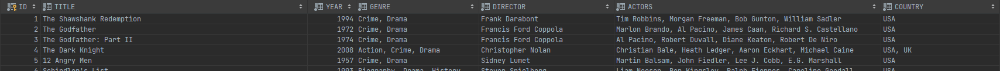

# Movie Rater

Progetto java predisposto per leggere da un database SQL contenente una lista di film.



## Dettagli Tecnici

- Progetto Maven
- Java 17 (es. https://adoptium.net/temurin/releases/?version=17)
- Database sqlite creato e popolato automaticamente all'avvio dell'applicazione. 
Il file `movies.sqlite` viene creato automaticamente all'avvio dell'applicazione 

## Avvio dell'applicazione

Per lanciare l'applicazione, configurare la propria JAVA_HOME per puntare a un'installazione JDK17 e lanciare

```java
./mvnw compile exec:java
``` 

In alternativa, lanciare la classe `MainApplication` direttamente dal proprio IDE.

## Struttura del codice e svolgimento

Per ogni task da completare creare una nuova classe nel package `it.intesys.recruting.movierater.tasks`.

```
.                      
├── DatabaseConfig.java   # utility per l'inizializzazione del db sqlite
├── MainApplication.java  # class contenente il main method
├── Movie.java            # oggetto di supporto per mappare i dati del db
├── MovieRepository.java  # utility per l'interrogazione del db
└── tasks                 # lista dei task. Aggiungere in questa cartella i task da implementare.  
    ├── Task.java
    ├── Task01_ListMoviesExample.java  
    ├── Task02_ListMoviesByYearExample.java
    ├── Task03_CountMovies.java
    └── Task04_RandomMovie.java
```

## Consegna del codice

Inserire nei messaggi di commit il numero del task ed effettuare il push delle modifiche direttamente su questo repository.
Al termine del lavoro avvisare il referente di Intesys.

## Task

Si richiede quindi di implementare le seguenti funzionalità:

1. Completare il task `Task03_CountMovies`
1. Completare il task `Task04_RandomMovie`
1. Altri task scelti e/o inviati dal referente Intesys 


## Elementi considerati per la valutazione

- numero di task completati
- pulizia del codice
- performance
- ordine e gestione sorgenti
- tempo di svolgimento

## Note
Per rendere il processo di selezione equo per tutti, si prega di non condividere con nessuno questo assignment o la soluzione proposta.


